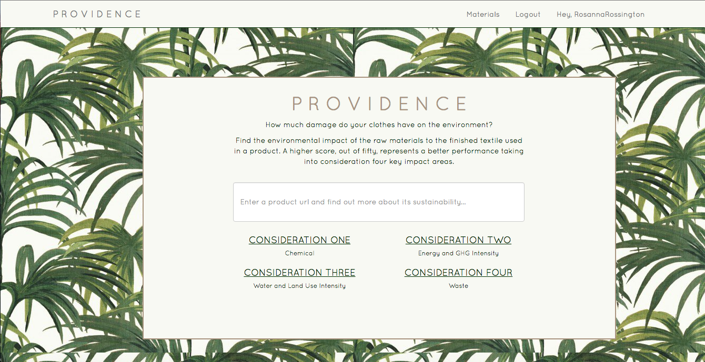
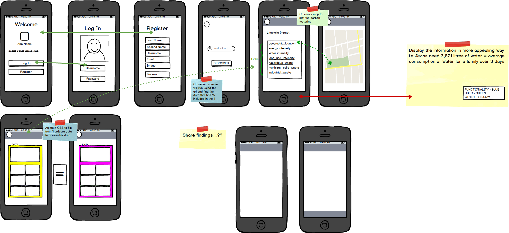
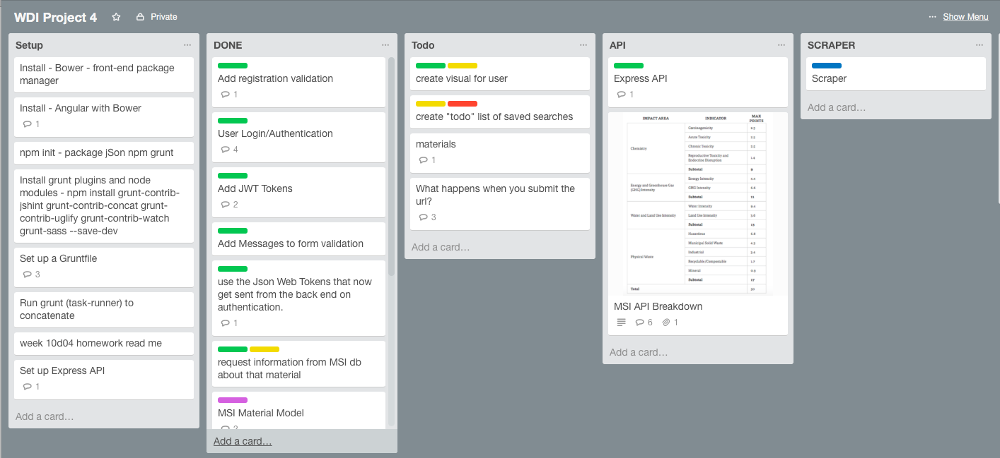

#Providence

_/ˈprɒvɪd(ə)ns/_
noun
1.the protective care of nature as a spiritual power.

##How much damage do your clothes have on the environment?

[Providence](https://the-providence.herokuapp.com/)

###Introduction

An AngularJS application with an Express backend using Nike’s MSI database.

An independent six-day project to raise awareness regarding the environmental impact of materials used in products on Net-a-Porter.com.

###Functionality: 

Browse Net-a-Porter.com. Register. Log In. Copy and paste the product page URL into Providence and see what material the product is made from and the sustainability score in four key areas of those materials.

###Technologies used: 
Using _Bower_ and _Grunt_ the application is set up using _Passport authentication strategy_  and _JWT tokens_.  A _Jake_ request is set up to request specific fields for each material saved in the MSI database. On input the application scrapes the product page of the URL using _Cheerio_ and pulls the information that is saved on the same line as %, the data is “cleaned” and then cross-referenced using _Regex_ to return the sustainability score for the materials used to produce the product.

###Planning tools used:
Balsamiq was used to produce a wireframe

Trello was used to manage tasks and work flow

